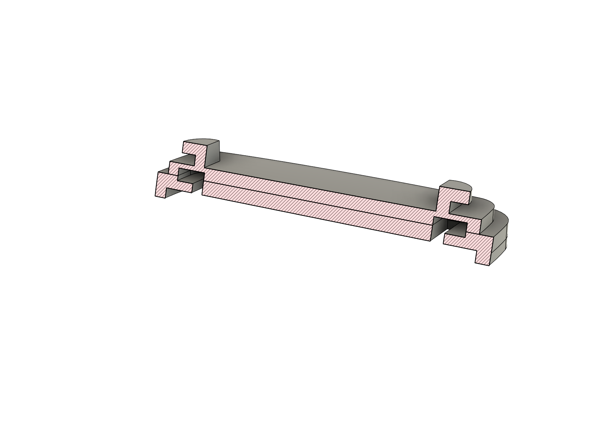
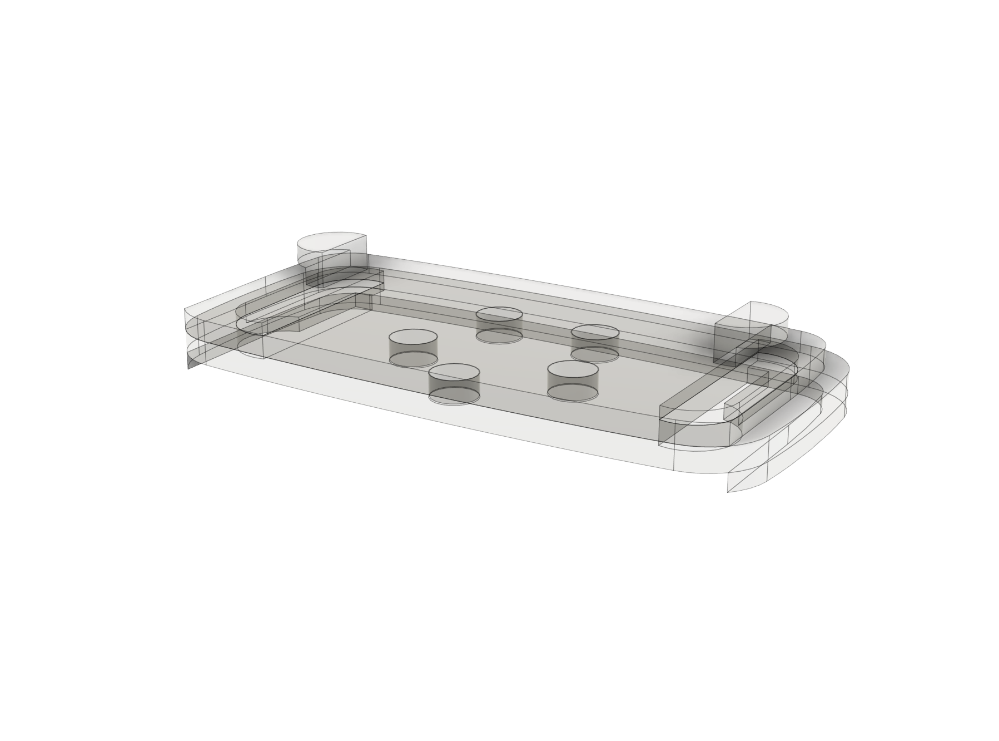
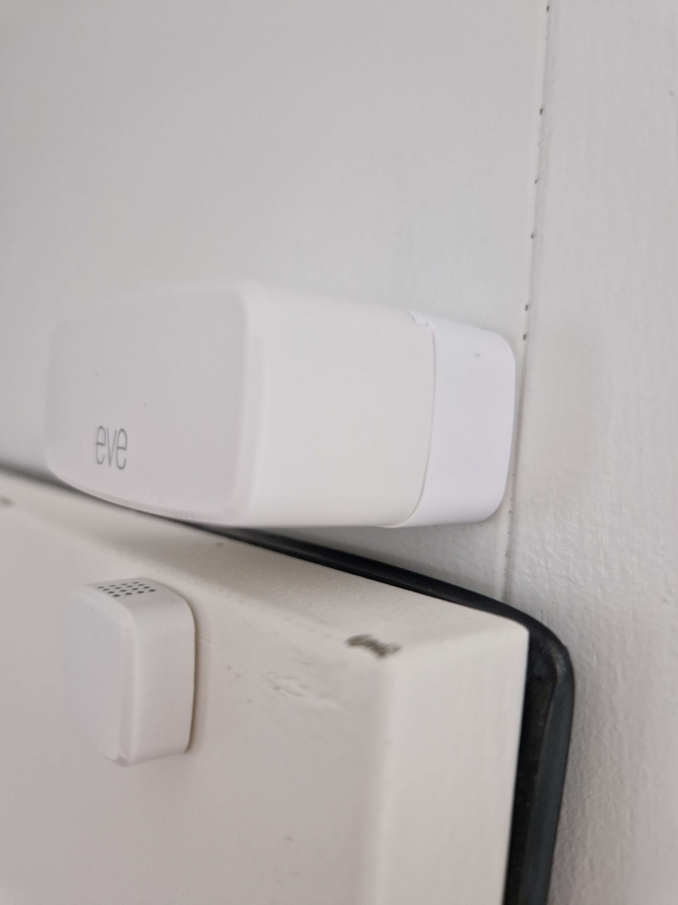

# Base Plate And Spacer for EVE Door & Window Sensor

A 3D printable spacer system designed to optimize the mounting of the [EVE Door & Window Sensor](https://www.evehome.com/en/eve-door-window). This includes multiple spacer sizes (3.5 mm to 20 mm) with clean press-fit assembly and standalone wall-mount variants.

- [Overview](#overview)
- [Installation](#installation)
- [Usage](#usage)
- [Known Issues](#known-issues)
- [Previews](#previews)
- [Contributing](#contributing)
- [License](#license)
- [Contact](#contact)
- [Disclaimer](#disclaimer)

## Overview

This project provides a set of modular, 3D printable spacers specifically for the EVE Door & Window Sensor. With multiple heights and standalone wall-mount configurations, it offers a more flexible installation experience than the standard package.

- **Product**: Spacer / Wall-mount system designed for [EVE Door & Window Sensor](https://www.evehome.com/en/eve-door-window)
- **License**: [CC BY-NC-SA 4.0](https://creativecommons.org/licenses/by-nc-sa/4.0/)
- **Two Styles**: Spacers or standalone wall-mount plates
- **Available in 5 Sizes**: 0 mm, 3.5 mm, 5 mm, 10 mm, and 20 mm variants  
- **Ready-to-Print**: Includes `.stl` and `.3mf` files
- **Two-Part Print (Spacers only)**: For easier printing (press-fit assembly)
- **Material**: PLA, PETG, or other commonly used filament types

## Installation

### Included Variants

#### Wall-Mount / Base Versions  
Each wall mount includes the base and platform as a unified component:
| Height | Filament  | File                                                                                                                  |
|--------|-----------|-----------------------------------------------------------------------------------------------------------------------|
| 0 mm   | 3g (8g)   | [3mf](models/EveDoorAndWindowSensorWallmountBase0mm.3mf), [stl](models/EveDoorAndWindowSensorWallmountBase0mm.stl)    |
| 3.5 mm | 5g (12g)  | [3mf](models/EveDoorAndWindowSensorWallmountBase3.5mm.3mf), [stl](models/EveDoorAndWindowSensorWallmountBase3.5mm.stl)|
| 5 mm   | 5g (13g)  | [3mf](models/EveDoorAndWindowSensorWallmountBase5mm.3mf), [stl](models/EveDoorAndWindowSensorWallmountBase5mm.stl)    |
| 10 mm  | 7g (15g)  | [3mf](models/EveDoorAndWindowSensorWallmountBase10mm.3mf), [stl](models/EveDoorAndWindowSensorWallmountBase10mm.stl)  |
| 15 mm  | 9g (17g)  | [3mf](models/EveDoorAndWindowSensorWallmountBase15mm.3mf), [stl](models/EveDoorAndWindowSensorWallmountBase15mm.stl)  |
| 20 mm  | 11g (18g) | [3mf](models/EveDoorAndWindowSensorWallmountBase20mm.3mf), [stl](models/EveDoorAndWindowSensorWallmountBase20mm.stl)  |

#### Spacer Versions  
Designed to be used between the wall mount base plate and the sensor. Each consists of a two-part press-fit design:
| Height | Filament  | File                                                                                                    |
|--------|-----------|---------------------------------------------------------------------------------------------------------|
| 3.5 mm | 6g (14g)  | [3mf](models/EveDoorAndWindowSensorSpacer3.5mm.3mf), [stl](models/EveDoorAndWindowSensorSpacer3.5mm.stl)|
| 5 mm   | 7g (15g)  | [3mf](models/EveDoorAndWindowSensorSpacer5mm.3mf), [stl](models/EveDoorAndWindowSensorSpacer5mm.stl)    |
| 10 mm  | 9g (17g)  | [3mf](models/EveDoorAndWindowSensorSpacer10mm.3mf), [stl](models/EveDoorAndWindowSensorSpacer10mm.stl)  |
| 15 mm  | 11g (19g) | [3mf](models/EveDoorAndWindowSensorSpacer15mm.3mf), [stl](models/EveDoorAndWindowSensorSpacer10mm.stl)  |
| 20 mm  | 13g (21g) | [3mf](models/EveDoorAndWindowSensorSpacer20mm.3mf), [stl](models/EveDoorAndWindowSensorSpacer20mm.stl)  |

### Printing Instructions

1. **Download the Files**  
   Models are provided in both `.stl` and `.3mf` formats.
   You can download the models via [MakerWorld](https://makerworld.com/en/models/your-model-id-here).

2. **Slicing Recommendations**
   - Supports: Required for optimal result
   - Material: PETG  
   - Orientation: Default model orientation is recommended

3. **Printing Notes**  
   Only the spacer variants are split into two parts (a back plate and a front platform) for better printability. Wall-mount models are single-piece designs.

### Assembly Instructions

For spacer variants (two-part models):
1. Remove any supports and clean contact surfaces if needed.
2. Press the two parts together — no glue is typically required.  
   - The fit is held by five circular pillars designed to press-fit into matching holes.
   - A clamp or vise can help if extra force is needed.
   - If the press-fit is too tight, lightly sanding the posts may help.

Mount the assembled piece to the surface, then attach the EVE sensor.

## Usage

These spacers help with proper alignment of the [EVE Door & Window Sensor](https://www.evehome.com/en/eve-door-window) during installation. This system offers additional flexibility in mounting configurations. E.g. aligning the sensor when door/window frames are thick.

## Known Issues

### Fragile L-Shaped Overhang (All Variants)

All variants feature a small L-shaped overhang that supports the sensor platform. This element is only 1.8 mm thick at the base where it connects to the main body, making it susceptible to breakage under mechanical stress, especially when printed in brittle materials like PLA or PETG.

If you have suggestions or ideas for overcoming this structural weakness, feel free to share them.

## Previews

### Renders

#### Spacer (two-part design)

#### Section view of the spacer

#### Wireframe view of the spacer

#### Wall-mount variant

### Printed Examples
The following printed examples were produced on a Bambu Lab X1C.

#### Printed spacer version

#### Printed wall-mount version

#### Printed wall-mount version with EVE sensor mounted

## Contributing

Contributions are welcome! You can help by:
- Suggesting improvements to the design
- Enhancing printability or compatibility
- Improving documentation
- Testing and providing feedback on different setups

To contribute, fork the repository, make your changes, and submit a pull request.

## License

This project is licensed under the [Creative Commons Attribution-NonCommercial-ShareAlike 4.0 International (CC BY-NC-SA 4.0)](https://creativecommons.org/licenses/by-nc-sa/4.0/) license.

You are free to:
- Share — copy and redistribute the material in any medium or format  
- Adapt — remix, transform, and build upon the material  

Under the following terms:
- Attribution — You must credit the creator.  
- NonCommercial — You may not use the material for commercial purposes.  
- ShareAlike — You must distribute your contributions under the same license.

## Contact

Questions, feedback, or suggestions? Open an [issue](https://github.com/healerz/eve-sensor-door-window-spacer/issues).

## Disclaimer
This project and its associated files are independent, third-party accessories designed for compatibility with the EVE Door & Window Sensor.
EVE is a trademark of Eve Systems GmbH. This project is not affiliated with, endorsed by, or sponsored by Eve Systems.