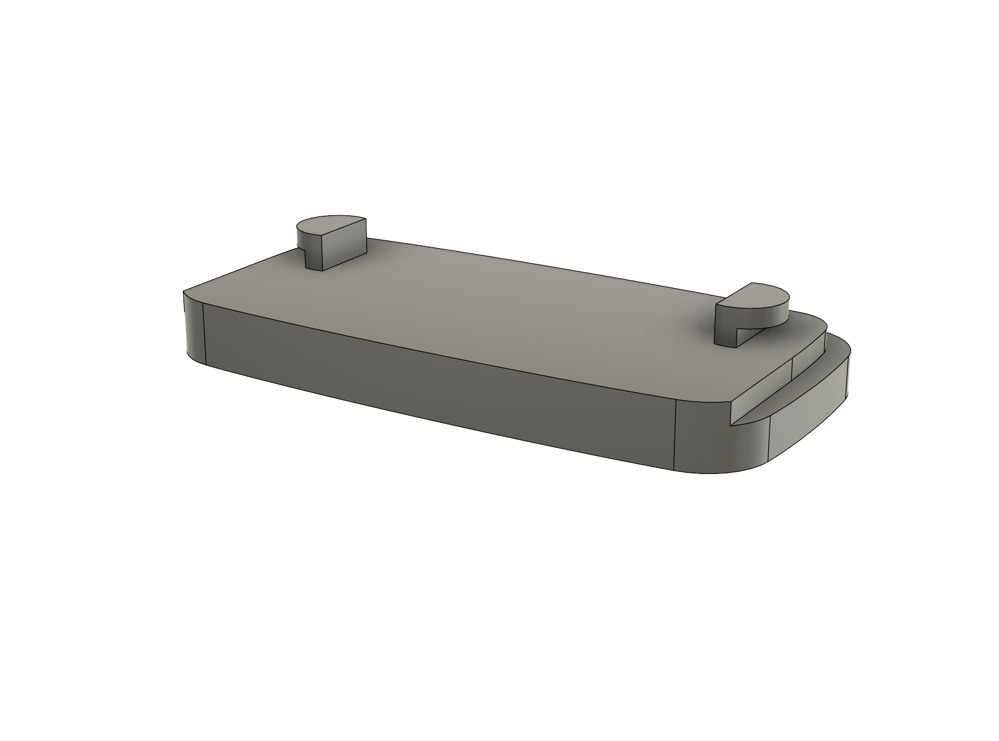

# EVE Door & Window Sensor Wallmount Base Plate And Spacer

A 3D printable spacer system designed to optimize the mounting of the [**EVE Door & Window Sensor**](https://www.evehome.com/en/eve-door-window). This includes multiple spacer sizes, standalone wall-mount variants, and a split model design for improved printability and flexibility.

## Overview

This project provides a set of modular, 3D printable spacers specifically for the EVE Door & Window Sensor. With multiple heights and standalone wall-mount configurations, it offers a more flexible installation experience than the standard package.

- **Product**: Spacer / Wall-mount system for [**EVE Door & Window Sensor**](https://www.evehome.com/en/eve-door-window)
- **Material**: PLA, PETG, or other commonly used filament types  
- **License**: [CC BY-NC-SA 4.0](https://creativecommons.org/licenses/by-nc-sa/4.0/)

---

## Features

- 📏 **Available in 5 Sizes**: 0 mm, 3.5 mm, 5 mm, 10 mm, and 20 mm variants  
- 🧱 **Two Styles**: Standalone spacers or standalone wall-mount plates
- 🛠️ **Two-Part Print (Spacers only)**: For easier printing
- 🧩 **Ready-to-Print**: Includes `.stl` and `.3mf` files
- 🔓 **Open-Source**: Modify or adapt the designs to fit your needs

---

## Previews

### Renders

*Spacer (two-part design) render*

*Wall-mount variant render*

*Section view showing the internal structure of the spacer*

### Printed Examples

  
*Printed spacer version*

  
*Printed wall-mount version*

  
*Printed wall-mount version with EVE sensor mounted*

---

## Installation

### Included Variants

#### Wall-Mount / Base Versions  
Each wall mount includes the base and platform as a unified component:
- `wall_mount_0mm`
- `wall_mount_3.5mm`
- `wall_mount_5mm`
- `wall_mount_10mm`
- `wall_mount_20mm`

#### Spacer-Only Versions  
Designed to be used between the wall mount base plate and the sensor. Each consists of a two-part press-fit design:
- `spacer_3.5mm`
- `spacer_5mm`
- `spacer_10mm`
- `spacer_20mm`

### Printing Instructions

1. **Download the Files**  
   Models are provided in both `.stl` and `.3mf` formats.
   You can also download the models via [MakerWorld](https://makerworld.com/en/models/your-model-id-here).

2. **Slicing Recommendations**
   - Layer Height: `0.2mm`  
   - Infill: `20%` (Grid or Cubic)  
   - Supports: Required for optimal result
   - Material: PLA or PETG  
   - Orientation: Default model orientation is optimal

3. **Printing Notes**  
   Only the **spacer variants** are split into two parts (a back plate and a front platform) for better printability. Wall-mount models are single-piece designs.

### Assembly Instructions

For spacer variants (two-part models):
1. Remove any supports and clean contact surfaces if needed.
2. Press the two parts together — no glue is typically required.  
   - The fit is held by **five circular pillars** designed to press-fit into matching holes.
   - A clamp or vise can help if extra force is needed.

Mount the assembled piece to the surface, then attach the EVE sensor.

---

## Usage

These spacers help with proper alignment of the [**EVE Door & Window Sensor**](https://www.evehome.com/en/eve-door-window) during installation. This system offers additional flexibility in mounting configurations.

---

## Contributing

Contributions are welcome! You can help by:
- Suggesting improvements to the design
- Enhancing printability or compatibility
- Improving documentation
- Testing and providing feedback on different setups

To contribute, fork the repository, make your changes, and submit a pull request.

---

## License

This project is licensed under the **[Creative Commons Attribution-NonCommercial-ShareAlike 4.0 International (CC BY-NC-SA 4.0)](https://creativecommons.org/licenses/by-nc-sa/4.0/)** license.

You are free to:
- **Share** — copy and redistribute the material in any medium or format  
- **Adapt** — remix, transform, and build upon the material  

Under the following terms:
- **Attribution** — You must credit the creator.  
- **NonCommercial** — You may not use the material for commercial purposes.  
- **ShareAlike** — You must distribute your contributions under the same license.

---

## Contact

Questions, feedback, or suggestions? Open an [issue on GitHub](https://github.com/healerz/eve-sensor-door-window-spacer/issues)